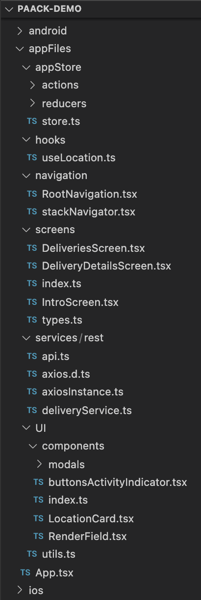

# The MVP requirements:
* The app should list out the different deliveries for the driver.
* When the driver clicks on a delivery, it should show him the details page for the delivery.
* The details page for the delivery has a "Make active" button that the driver uses to make the delivery as their current active delivery.
* While a delivery is active, the driver cannot mark another delivery as active.
* Once the delivery is active, two new buttons should appear: one to mark the delivery as delivered and another to mark it as undelivered.
* When the user clicks one of the buttons, a request will be sent to finish the delivery setting the status to “delivered” or “undelivered”, along with the current gps location of the driver.
* Once the delivery has been delivered, it shouldn’t be possible to active it again, making imposible to finalice the delivery again.

# There are three endpoints to handle the delivery process:
1. List deliveries - An endpoint that returns the deliveries assigned to the driver. Containing the customer info and the current delivery
status. Default status is “idle”.
2. Delivery details - An endpoint to get the detail of a specific delivery. Containing the customer info and the current delivery status.
Default status is “idle”.
3. Finish delivery - An endpoint to mark a delivery as delivered or undelivered. You have to define the following parameters:
  * status: To indicate if we want to mark the delivery as delivered or undelivered.
  * latitude: The latitude from the driver device.
  * longitude: The longitude from the driver device.

This demo does not handle UI and aesthetics of the application. (This solution will be evaluated based on its code decision and architectural design)

# Non functional requirements:
* Write a documentation about how to set up the project, to help the new team members to set up the project easily.
* We care about software quality:
* Apply a clear structure to the project, we like architecture patterns.
* Ensure a proper test coverage level, we like good testing practices, test business logic and views.
* Use a navigation library to navigate between the different pages.
* Use a global state library (Redux, MobX or your choice) to manage the application state.


# Running the project:
 -for running project assure environment complies with https://reactnative.dev/docs/environment-setup React Native CLI Quickstart tab (including setting JAVA_HOME and ANDROID_SDK_HOME variables)
- in root folder of project(paack-demo/) run in terminal/console:
 >``` npm i --save --legacy-peer-deps ``` (installing project's dependencies)
- android starting up:
 >``` npm run android ```  (If is windows environment use >``` npm run android-win``` )
- ios starting up:  open paack-demo/ios/paackdemo.xcworkspace after running:
 >```cd ios ```
 >``` pod install ```
 
 - let xCode index files, if is M1 Apple chip machine
  exclude arm64 architectures for Any IOS Simulator SDK in Build Settings options and 
  run paackdemo/paackdemo.dev schemas with Debug Build Configuration
 - on consecutive runs you coud start it even with 
   >``` npm run ios-dev ```

# Project structure 


- only development mode implementations (debug.keystore)
- [x] implemented react navigation 6 stack navigator (referenced) in appFiles/navigation folder
- [x]implemented 3 screens in  appFiles/screens:
    - [x] IntroScreen with network connectivity and location permissions checks
    - [x] DeliveriesScreen with deliveries list render
    - [x] DeliveryDetailsScreen with delivery details and functionalities for making delivery active , changing delivery status
- [x] implemented 2 modals components (Loading modal that blocks entire screen while active and InfoModal for outputting messages) and 2 react components in appFiles/UI/components
- [x] implemented react-native redux with 2 reducers (appReducer and modalsReducer) and redux-persist in appFiles/appStore
- [x] implemented rest api deliveryService in appFiles/services/res using axiosInstance with interceptors and rxjs observable for delivering only response necessary at client-side component
- [x] implemented unit tests and wrote tests in __tests__ folder. 
    For automated tests, run in root folder console/terminal :
     >```npm run test```

     >```npm run coverage -- -u```


